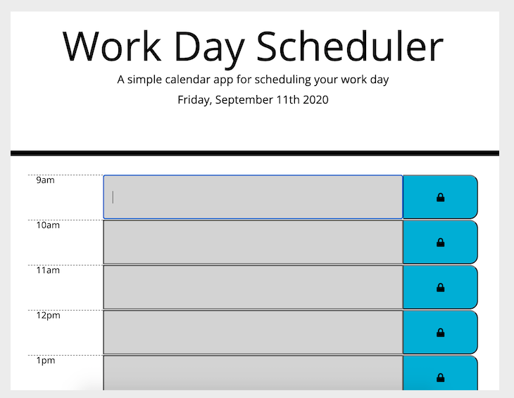
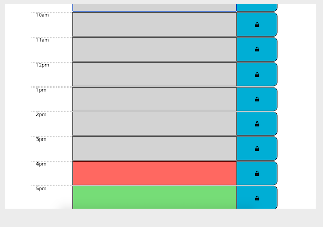

# Work Day Scheduler

## Description

In this project, we needed to create build a work day scheduler that dynamicaly changes the time block highlighting the hour of the day that is important and reflecting gray areas for past and green areas for future. 

User can add and edit and save anything that needs to be saved on the timeblocks of the particular day and be able to refresh and see the tasks that are at hand.

Sharing the importants of making sure user is able to add and save tasks and the way the timeblocks are changing based on the time of day using moment.js.

## Snapshot Preview

## Installation

Explore in chrome browser the Work Day Scheduler to observe and allocate tasks to be done during the busy work day. Being able to edit and add and save withint the parameters of the hours of the day for tasks to be completed in normal working schedule.

## Usage

* User can look at the time of day in a busy work schedule to be able to see tasks for the day ahead
* User can add more task and save for future timeblocks
* User is able to save and refresh page to find tasks that needs to be completed saved by clicking the lock icon.

## Links
momentjs.com

https://seykoplik.github.io/WorkDayScheduler/

--- 
© 2020 Seychelle Koplik